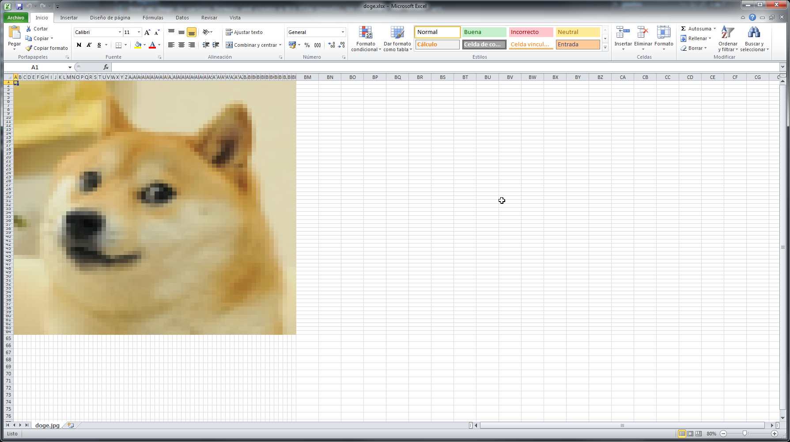
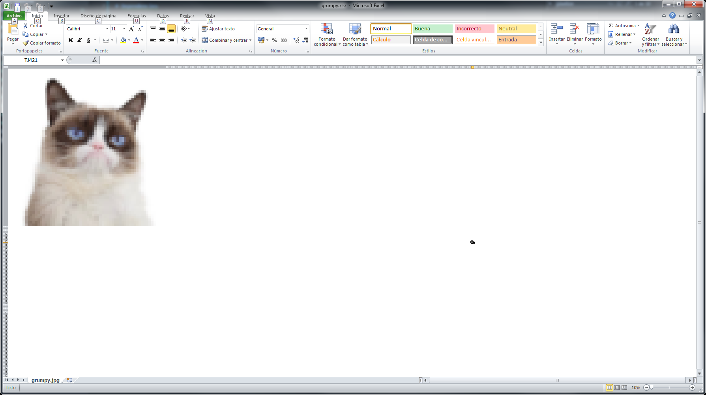
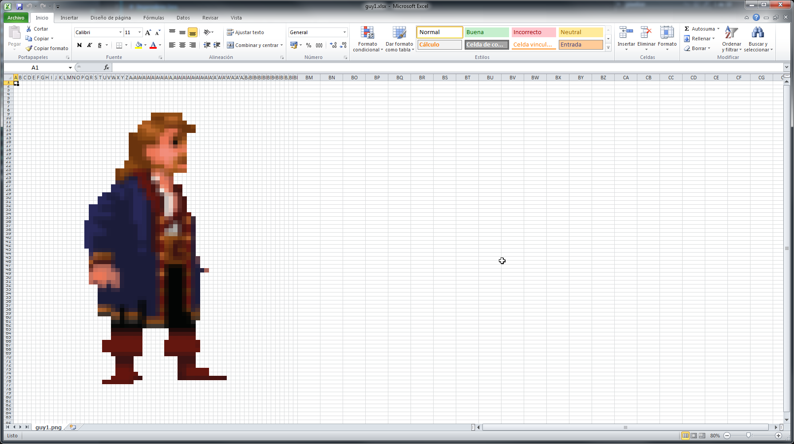
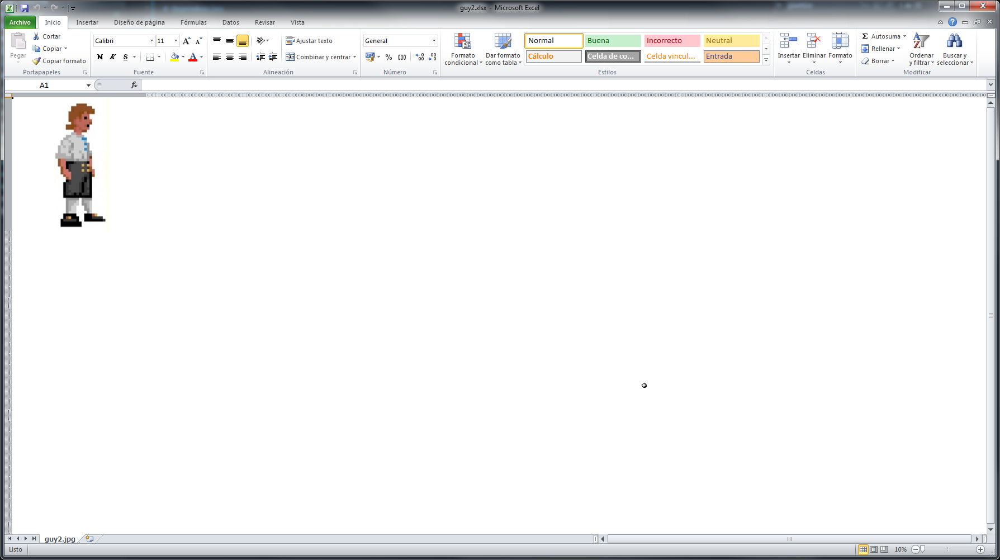
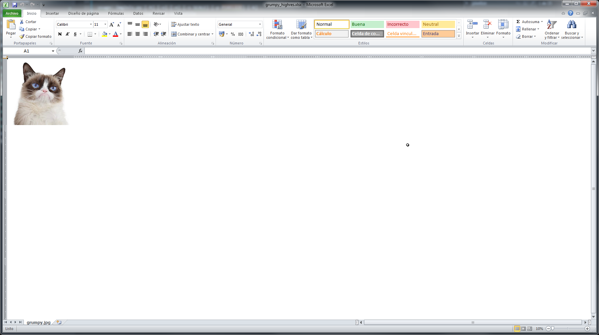

# img2xls
Read an image in various formats and create a XLS file (excel), to replicate the "pixel" art. 

The tool generates the excel file, and adjust some parameters, as cell size, metadata, name, and zoom
to fit the image inside the excel. Due to limitations of excel as "drawing app", the results may vary.
Note that the EXCELS file can be *huge* if you process a *big* image.

# Dependencies

* [Python3](https://www.python.org/download/releases/3.0/)
* [xlsxwriter](https://xlsxwriter.readthedocs.io/) module to create the XLS file
* [PILlow](https://pillow.readthedocs.io/en/stable/) to read the images

# Installation

1. Clone the repo [img2xls](ttps://github.com/juanmcasillas/img2xls) in your machine, extract it.
2. Ensure you have **python3**, **xlsxwriter** and **PILlow** installed in your system.
3. Run it.

# Arguments and options

```
usage: img2xls.py [-h] [-v] [-n] [-s SCALE] [-p PIXELIZE] [-k]
                  inputfile outputfile

positional arguments:
  inputfile             The image file to be read
  outputfile            output file. Generates an EXCEl compatible file

optional arguments:
  -h, --help            show this help message and exit
  -v, --verbose         increase output verbosity
  -n, --noalpha         Skip alpha channel
  -s SCALE, --scale SCALE
                        Percent scale (200 -> double, 50 -> half)
  -p PIXELSIZE, --pixelsize PIXELSIZE
                        Create a pixelize efect of PxP pixels (e.g. 16x16).
  -k, --keepsmall       Don't resize again when pixelize
```

* `inputfile`: the input image file. Keep it as small as possible. Supported formats: all supported by PILlow. Support alpha channel (somewhat)
* `outputfile`: the name for the EXCEL file. should end with `.xlsx`
* `-v`: verbosity level. Shows things about the scale rate, and so on.
* `-n`: ignore alpha channel. Alpha channel is an optimization that doesn't fill the cell with the alpha color.
* `-s SCALE`: reescale the image by some percent. 200 means double, 50, half.
* `-p PIXELSIZE`: generates a pixelize version of the image, of PIXELSIZE size. 16-64 generates good results. It manages the image ratio, also.
* `-k`: keep the image as scaled to pixelsize. If not selected, the image is scaled to SCALE (if found). Generates a very SMALL version of the image.

# Examples

* `python img2xls.py -k -p 64 -v img\doge.jpg xls\doge.xlsx`. Creates a small version (`-k`) with verbosity (`-v`) and pixelize to 64 pixels (`-p 64`)
[doge.xlsx](xls/doge.xlsx)

* `python img2xls.py -p 64 -v img\grumpy.jpg xls\grumpy.xlsx`. Creates a and pixelized version to 64 pixels (`-p 64`) with verbosity (`-v`) of grumpy the cat
[grumpy.xlsx](xls/grumpy.xlsx)

* `python img2xls.py -k -v -p 64  img\guy1.png xls\guy1.xlsx`. Creates a pixelized version of 64 pixels, keeping the small image (see the zoom)
[guy1.xlsx](xls/guy1.xlsx)

* `python img2xls.py -v -s 50 img\guy2.jpg xls\guy2.xlsx`. Scale down the guy2 to 50% smaller.
[guy2.xlsx](xls/guy2.xlsx)

* `python img2xls.py -s 50 -v img\grumpy.jpg xls\grumpy.xlsx`. Grumpy high res, but scaled 50%
[grumpy_highres.xlsx](xls/grumpy_highres.xlsx)
